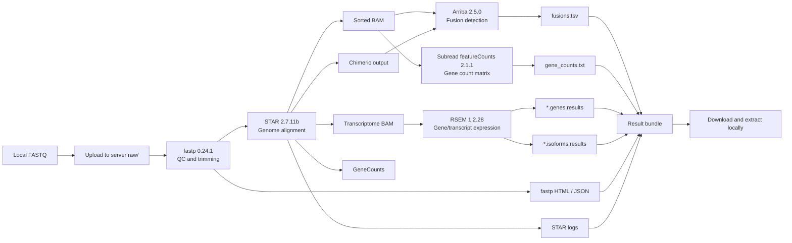

# SysuccOmicAgent

SysuccOmicAgent is an interactive omics analysis agent. It can validate local FASTQ files, upload them to a remote server, generate remote pipeline scripts, submit the job through `slurm`, `pbs`, or a remote background shell, poll job state, download result bundles, and send email notifications. The current registered workflows cover RNA-seq, ATAC-seq, ChIP-seq, and CUT&Tag.

Author: Qi Zhao <zhaoqi@sysucc.org.cn>

## Current Capabilities

- Interactive wizard with step-by-step progress.
- One-time default reference setup for GENCODE human release 47.
- Per-project local FASTQ, server, polling, notification, workflow backend, reference, and pipeline configuration.
- Runtime estimate based on sample count, read depth, selected steps, and thread count.
- Local FASTQ validation before upload.
- Upload command generation for transferring local FASTQ files to the server.
- End-to-end `run` command for validate -> upload -> submit -> poll -> download.
- `status` command for refreshing current remote state.
- Email notification settings stored in the project config.
- JSON configuration only for now, so the tool runs with the Python standard library.
- Optional nf-core backend hooks for ATAC-seq, ChIP-seq, and CUT&Tag projects when Nextflow is available on the server.

## Analysis Workflow



## Assumptions

- The local machine can access the server with `ssh` and `scp`.
- The server has `bash`, `tar`, and the configured RNA-seq tools in `PATH`, or can expose them through `init_commands`.
- Reference files and indexes already exist on the server and their paths are correct in the saved defaults.
- `slurm`, `pbs`, or plain remote shell execution is available, matching `server.scheduler`.

## Usage

Full Chinese usage guide: [docs/usage.md](docs/usage.md)

Project flow diagrams: [docs/flow.md](docs/flow.md)

Workflow backend details: [docs/workflows.md](docs/workflows.md)

From this repository without installation:

```powershell
$env:PYTHONPATH = "src"
python -m rnaseq_agent gui
```

Or install it in editable mode:

```powershell
python -m pip install -e .
sysucc-omic-agent gui
```

Recommended flow:

```powershell
$env:PYTHONPATH = "src"
python -m rnaseq_agent gui
python -m rnaseq_agent run runs/<project_id>/project.json
```

`gui` is the recommended entry for most users. It opens a desktop form, validates the fields, and writes `runs/<project_id>/project.json`.
The GUI can also run the analysis directly with "Save and Run", submit without waiting, and refresh remote status.

Use `chat` when a graphical desktop is not available. It asks questions conversationally, shows examples, confirms a summary, and writes `runs/<project_id>/project.json`.

## Agent vs Traditional Software

This project has a GUI, but its core is still an agent-style workflow:

- Configuration is stored as explicit, reusable JSON rather than hidden GUI state.
- Every run generates scripts, logs, status files, and downloadable artifacts for auditing.
- The GUI, chat mode, and CLI all drive the same execution engine.
- The analysis workflow can be extended to other pipelines without redesigning the interface.
- It orchestrates local data, remote execution, polling, download, and notification instead of only running local actions.

## Extensible Workflow Structure

SysuccOmicAgent uses a workflow registry. The current registered workflows are:

- `rnaseq` - Bulk RNA-seq analysis
- `atacseq` - ATAC-seq alignment, QC, bigWig, and peak calling
- `chipseq` - ChIP-seq alignment, QC, bigWig, and peak calling
- `cuttag` - CUT&Tag alignment, QC, bigWig, and peak calling

Project configs include:

```json
{
  "workflow": {
    "type": "rnaseq",
    "label": "Bulk RNA-seq"
  }
}
```

To add another omics workflow later, add a module under `src/rnaseq_agent/workflows/` that implements the workflow interface, then register it with `register_workflow()` in `workflows/registry.py`. The GUI, chat mode, CLI runner, upload, polling, and download logic can be reused.

Each workflow owns its analysis-specific behavior:

- `default_reference()` returns reference defaults for that workflow.
- `default_pipeline()` returns step defaults and versions.
- `normalize_config(config)` merges workflow defaults into a project config.
- `validate_config(config)` checks workflow-specific dependencies and required reference files.
- `render_env_setup_script(config)`, `render_pipeline_script(config)`, and `render_submit_script(config)` generate remote scripts.
- `result_dirs` lists remote result folders that should be bundled and downloaded.

ATAC-seq, ChIP-seq, and CUT&Tag support two execution backends:

```json
{
  "execution": {
    "backend": "bash"
  }
}
```

`bash` renders a lightweight server script using common command-line tools such as `fastp`, `bowtie2` or `bwa`, `samtools`, `picard`, `bedtools`, `deepTools`, and `macs2`. Use this when those tools are already managed by the server environment.

```json
{
  "execution": {
    "backend": "nfcore",
    "nfcore": {
      "pipeline": "nf-core/atacseq",
      "revision": "2.1.2",
      "profile": "singularity",
      "params": {},
      "extra_args": ""
    }
  }
}
```

`nfcore` renders a Nextflow command and samplesheet for the matching nf-core pipeline. The built-in defaults are `nf-core/atacseq`, `nf-core/chipseq`, and `nf-core/cutandrun` for CUT&Tag/CUT&RUN-style projects. Override `revision`, `profile`, and `params` to match the server environment.

If you want to inspect the individual steps first:

```powershell
$env:PYTHONPATH = "src"
python -m rnaseq_agent validate-local runs/<project_id>/project.json
python -m rnaseq_agent upload-command runs/<project_id>/project.json
python -m rnaseq_agent estimate runs/<project_id>/project.json
python -m rnaseq_agent status runs/<project_id>/project.json
```

Example configs:

- [examples/project.demo.json](examples/project.demo.json) - RNA-seq
- [examples/project.atacseq.demo.json](examples/project.atacseq.demo.json) - ATAC-seq
- [examples/project.chipseq.demo.json](examples/project.chipseq.demo.json) - ChIP-seq
- [examples/project.cuttag.demo.json](examples/project.cuttag.demo.json) - CUT&Tag

The wizard writes:

- User defaults: `%USERPROFILE%/.sysu_rnaseq_agent/defaults.json`
- Project config: `runs/<project_id>/project.json`
- Generated remote scripts: `runs/<project_id>/generated_scripts/`
- Agent logs: `runs/<project_id>/agent_logs/`
- Downloaded bundle: `runs/<project_id>/downloads/downloads_bundle.tar.gz`
- Extracted results: `runs/<project_id>/downloads/extracted/`

## RNA-seq Reference Defaults

The default reference follows the requested GENCODE Human Release 47 files:

- GTF: `gencode.v47.chr_patch_hapl_scaff.annotation.gtf.gz`
- FASTA: `GRCh38.p14.genome.fa.gz`
- Assembly: `GRCh38.p14`
- Region set: `ALL`

`ALL` matches the screenshot selection and includes reference chromosomes, scaffolds, assembly patches, and alternate loci. For smaller routine expression workflows, a future preset can add the primary assembly option.

## Notes

- For HPC environments that require `module load` or `conda activate`, fill `server.init_commands` in the wizard.
- `run` blocks until completion by default. Use `--no-wait` to return after submission:

```powershell
$env:PYTHONPATH = "src"
python -m rnaseq_agent run runs/<project_id>/project.json --no-wait
```

- The downloaded result is saved as a `.tar.gz` bundle and automatically extracted under `downloads/extracted/`.

## Planned Next Steps

1. Add checksum recording before and after upload.
2. Add a native `claw` backend as an alternative to `ssh` and `scp`.
3. Add local result interpretation and Markdown report generation.
4. Add more explicit tool-path and container configuration.
