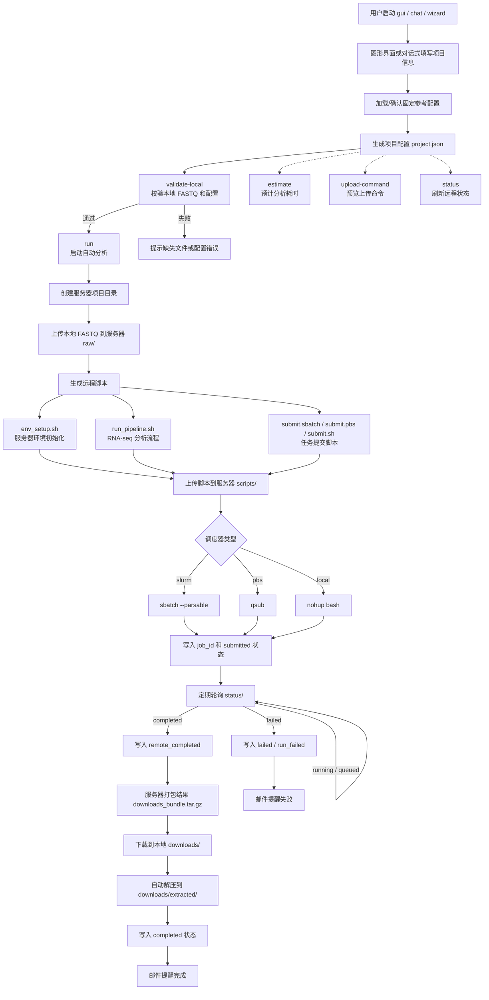
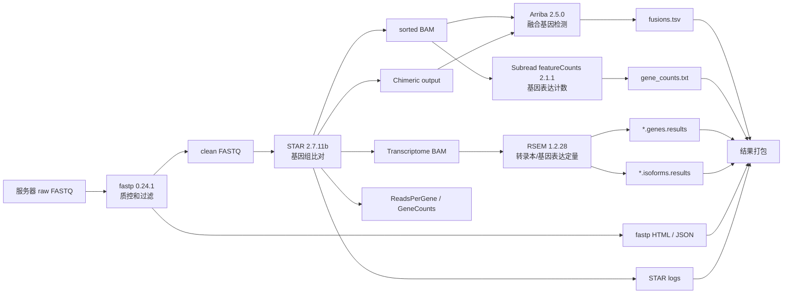
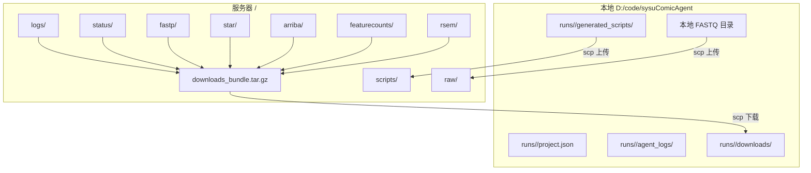

# SysuccOmicAgent 流程示意图

## 端到端流程

```mermaid
flowchart TD
    A["用户启动 gui / chat / wizard"] --> B["图形界面或对话式填写项目信息"]
    B --> C["加载/确认固定参考配置"]
    C --> D["生成项目配置 project.json"]

    D --> E["validate-local<br/>校验本地 FASTQ 和配置"]
    E -->|通过| F["run<br/>启动自动分析"]
    E -->|失败| E1["提示缺失文件或配置错误"]

    F --> G["创建服务器项目目录"]
    G --> H["上传本地 FASTQ 到服务器 raw/"]
    H --> I["生成远程脚本"]

    I --> I1["env_setup.sh<br/>服务器环境初始化"]
    I --> I2["run_pipeline.sh<br/>RNA-seq 分析流程"]
    I --> I3["submit.sbatch / submit.pbs / submit.sh<br/>任务提交脚本"]

    I1 --> J["上传脚本到服务器 scripts/"]
    I2 --> J
    I3 --> J

    J --> K{"调度器类型"}
    K -->|slurm| K1["sbatch --parsable"]
    K -->|pbs| K2["qsub"]
    K -->|local| K3["nohup bash"]

    K1 --> L["写入 job_id 和 submitted 状态"]
    K2 --> L
    K3 --> L

    L --> M["定期轮询 status/"]
    M -->|running / queued| M
    M -->|failed| N1["写入 failed / run_failed"]
    M -->|completed| N2["写入 remote_completed"]

    N2 --> O["服务器打包结果 downloads_bundle.tar.gz"]
    O --> P["下载到本地 downloads/"]
    P --> Q["自动解压到 downloads/extracted/"]
    Q --> R["写入 completed 状态"]

    N1 --> S["邮件提醒失败"]
    R --> T["邮件提醒完成"]

    D -.-> U["estimate<br/>预计分析耗时"]
    D -.-> V["upload-command<br/>预览上传命令"]
    D -.-> W["status<br/>刷新远程状态"]
```

## 服务器端 RNA-seq 分析流程

```mermaid
flowchart LR
    A["服务器 raw FASTQ"] --> B["fastp 0.24.1<br/>质控和过滤"]
    B --> C["clean FASTQ"]

    C --> D["STAR 2.7.11b<br/>基因组比对"]
    D --> E["sorted BAM"]
    D --> F["Transcriptome BAM"]
    D --> G["Chimeric output"]
    D --> H["ReadsPerGene / GeneCounts"]

    E --> I["Arriba 2.5.0<br/>融合基因检测"]
    G --> I
    I --> I1["fusions.tsv"]

    E --> J["Subread featureCounts 2.1.1<br/>基因表达计数"]
    J --> J1["gene_counts.txt"]

    F --> K["RSEM 1.2.28<br/>转录本/基因表达定量"]
    K --> K1["*.genes.results"]
    K --> K2["*.isoforms.results"]

    B --> L["fastp HTML / JSON"]
    D --> M["STAR logs"]

    I1 --> N["结果打包"]
    J1 --> N
    K1 --> N
    K2 --> N
    L --> N
    M --> N
```

## 本地和服务器目录关系

```mermaid
flowchart TB
    subgraph Local["本地 D:/code/sysuComicAgent"]
        A1["runs/<project_id>/project.json"]
        A2["runs/<project_id>/generated_scripts/"]
        A3["runs/<project_id>/agent_logs/"]
        A4["runs/<project_id>/downloads/"]
        A5["本地 FASTQ 目录"]
    end

    subgraph Remote["服务器 <remote_base_dir>/<project_id>"]
        B1["raw/"]
        B2["scripts/"]
        B3["logs/"]
        B4["status/"]
        B5["fastp/"]
        B6["star/"]
        B7["arriba/"]
        B8["featurecounts/"]
        B9["rsem/"]
        B10["downloads_bundle.tar.gz"]
    end

    A5 -->|"scp 上传"| B1
    A2 -->|"scp 上传"| B2
    B3 --> B10
    B4 --> B10
    B5 --> B10
    B6 --> B10
    B7 --> B10
    B8 --> B10
    B9 --> B10
    B10 -->|"scp 下载"| A4
```
